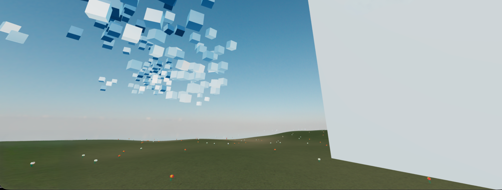

# Hello Worlds

Hello Worlds is a procedural 3D world generation tool that combines procedural generation algorithms with a visual node editor to create dynamic, immersive environments. It features a node-based authoring system for procedural content creation and a first-person exploration mode for navigating generated worlds.

**Key Features:**

- **Perlin Noise Node** — Multi-octave noise generation for terrain heightfields and procedural placement
- **Terrain Node** — 3D terrain mesh generation that automatically snaps objects to elevation
- **Agent Node** — Spawn configurable agents with position, velocity, and size parameters
- **Flocking Node** — Separation, alignment, and cohesion forces for natural group behavior
- **L-System Node** — Lindenmayer system string generation for procedural plant structures
- **Plant Node** — 3D plant rendering from L-systems with customizable branches and leaves
- **Flower Node** — Noise-driven flower distribution across terrain with density control
- **Building Grammar Node** — Procedural building generation with configurable levels, rooms, and layouts
- **Building Node** — Instantiate buildings from grammar definitions with terrain height snapping

---

## Quick Start

Visit the web application at [https://thomknoe.github.io/helloworlds](https://thomknoe.github.io/helloworlds/)

### Controls

#### Player Mode (First-Person)

- **W / A / S / D** — Move forward/left/backward/right
- **Mouse** — Look around
- **Click** — Enable pointer lock (required for mouse look)
- **P** — Toggle to Author Mode

#### Author Mode (Node Editor)

**Node Management:**

- **Click sidebar buttons** — Add nodes to the canvas
- **Drag nodes** — Reposition nodes on canvas
- **Click nodes** — Select and configure node parameters
- **Ctrl/Cmd + Click** — Multi-select nodes
- **Ctrl/Cmd + C** — Copy selected nodes
- **Ctrl/Cmd + V** — Paste copied nodes (offset by 50px)
- **Backspace/Delete** — Delete selected nodes

**Node Connections:**

- **Connect handles** — Link nodes by dragging from output to input handles
- **Animated edges** — Visual feedback for active connections

**Navigation:**

- **P** — Toggle back to Player Mode
- **Escape** — Unlock mouse cursor (required when switching to Author Mode from Player Mode)

---

## Node Reference

The application consists of multiple node components organized into four categories: **Noise & Heightfields**, **Agent & Behavior Systems**, **Simulation & Natural Systems**, and **Structural & Generative Grammars**. Each node processes inputs and generates outputs that can be connected to other nodes to create complex procedural content.

### Noise & Heightfield Nodes

#### Perlin Noise Node

Generates multi-octave Perlin noise for terrain heightfields and procedural placement. Creates smooth, natural-looking noise patterns ideal for terrain generation, texture variation, and flow field effects.

**Inputs:**

- `seed (number)`: Random seed for noise generation (default: 42)
- `scale (number)`: Noise scale factor controlling frequency (default: 0.05)
- `octaves (number)`: Number of noise layers combined for detail (default: 4, max: 8)
- `persistence (number)`: Amplitude decay per octave (default: 0.5)
- `amplitude (number)`: Height amplitude multiplier (default: 10)
- `frequency (number)`: Base frequency of the noise pattern (default: 1)

**Outputs:**

- `type`: "perlinNoise"
- `value`: Sampled noise value
- All input parameters as configuration object

#### Voronoi Noise Node

Generates Voronoi (cellular) noise patterns with configurable distance metrics. Creates cell-like patterns useful for organic textures, terrain features, and procedural placement.

**Inputs:**

- `seed (number)`: Random seed (default: 42)
- `scale (number)`: Noise scale factor (default: 0.1)
- `octaves (number)`: Number of octaves (default: 4)
- `persistence (number)`: Amplitude decay per octave (default: 0.5)
- `amplitude (number)`: Amplitude multiplier (default: 10)
- `mode (string)`: Distance metric - "f1", "f2", or "f2f1" (default: "f1")

**Outputs:**

- `type`: "voronoiNoise"
- All input parameters as configuration object

#### Simplex Noise Node

Generates Simplex noise, an improved version of Perlin noise with better computational efficiency and smoother gradients. Ideal for high-performance terrain and texture generation.

**Inputs:**

- `seed (number)`: Random seed (default: 42)
- `scale (number)`: Noise scale factor (default: 0.05)
- `octaves (number)`: Number of octaves (default: 4)
- `persistence (number)`: Amplitude decay per octave (default: 0.5)
- `amplitude (number)`: Amplitude multiplier (default: 10)
- `zOffset (number)`: Z-axis offset for 3D sampling (default: 0.0)

**Outputs:**

- `type`: "simplexNoise"
- All input parameters as configuration object

#### Ridge Noise Node

Generates ridge noise patterns by inverting and power-scaling noise values. Creates sharp, mountain-like features ideal for dramatic terrain generation.

**Inputs:**

- `seed (number)`: Random seed (default: 42)
- `scale (number)`: Noise scale factor (default: 0.05)
- `octaves (number)`: Number of octaves (default: 4)
- `persistence (number)`: Amplitude decay per octave (default: 0.5)
- `amplitude (number)`: Amplitude multiplier (default: 10)
- `offset (number)`: Value offset before power scaling (default: 0.0)
- `power (number)`: Power exponent for ridge sharpness (default: 2.0)

**Outputs:**

- `type`: "ridgeNoise"
- All input parameters as configuration object

#### Domain Warping Node

Applies domain warping to noise patterns, creating distorted and organic-looking variations. Uses a secondary noise function to warp the sampling coordinates of the primary noise.

**Inputs:**

- `seed (number)`: Random seed (default: 42)
- `baseScale (number)`: Base noise scale (default: 0.05)
- `warpStrength (number)`: Strength of domain warping (default: 5.0)
- `warpScale (number)`: Scale of warping noise (default: 0.1)
- `octaves (number)`: Number of octaves (default: 4)
- `persistence (number)`: Amplitude decay per octave (default: 0.5)
- `amplitude (number)`: Amplitude multiplier (default: 10)

**Outputs:**

- `type`: "domainWarping"
- All input parameters as configuration object

#### Terrain Node

Creates a 3D terrain mesh using noise configuration. Receives noise parameters from connected Noise Nodes and generates a terrain heightfield that all other objects automatically snap to. Controls water level and terrain dimensions.

**Inputs:**

- `config (object)`: Noise configuration from connected Noise Node (via config handle)
- `waterHeight (number)`: Water level height (default: 0)

**Outputs:**

- Terrain configuration forwarded directly to renderer, updates world terrain mesh

### Agent & Behavior System Nodes

#### Agent Node

Defines agent spawn parameters for flocking systems. Specifies how many agents to create, their initial positions, velocities, and physical properties. Multiple agents are generated per node based on the count parameter.

**Inputs:**

- `count (number)`: Number of agents to spawn (default: 10, max: 200)
- `positionX/Y/Z (number)`: Base spawn position (default: 0, 50, 0)
- `velocityX/Y/Z (number)`: Initial velocity (default: 0)
- `size (number)`: Physical size of each agent (default: 0.3)
- `spread (number)`: Spawn spread radius (default: 20.0)
- `behavior (object)`: Flocking behavior configuration from Flocking Node (via behavior handle)

**Outputs:**

- `type`: "agent"
- All input parameters as outputs

#### Boid Node

Defines individual boid entities for flocking systems. Similar to Agent Node but optimized for boid-specific properties and behaviors. Can be connected to Flocking Node for behavior configuration.

**Inputs:**

- `count (number)`: Number of boids to spawn (default: 10, max: 200)
- `positionX/Y/Z (number)`: Base spawn position (default: 0, 50, 0)
- `velocityX/Y/Z (number)`: Initial velocity (default: 0)
- `size (number)`: Physical size of each boid (default: 0.3)
- `spread (number)`: Spawn spread radius (default: 5.0)
- `behavior (object)`: Flocking behavior configuration from Flocking Node (via behavior handle)

**Outputs:**

- `type`: "boid"
- All input parameters as outputs

#### Flocking Node

Configures flocking behavior rules using separation, alignment, and cohesion forces. Defines how agents interact with each other and their environment, creating natural flocking patterns. Optionally accepts noise input for flow field effects.

**Inputs:**

- `separation (number)`: Separation force strength (default: 1.5)
- `alignment (number)`: Alignment force strength (default: 1.0)
- `cohesion (number)`: Cohesion force strength (default: 1.0)
- `separationRadius (number)`: Detection radius for separation (default: 2.0)
- `neighborRadius (number)`: Detection radius for neighbors (default: 5.0)
- `maxSpeed (number)`: Maximum speed limit (default: 5.0)
- `maxForce (number)`: Maximum steering force limit (default: 0.1)
- `boundsWidth (number)`: Boundary width dimension (default: 150)
- `boundsDepth (number)`: Boundary depth dimension (default: 150)
- `planeHeight (number)`: Vertical height of flocking plane (default: 50)
- `noise (object)`: Optional noise configuration for flow field effects

**Outputs:**

- `type`: "flocking"
- All input parameters as outputs

#### NPC Node

Creates non-player characters with configurable movement patterns, interaction radii, and procedural dialogue generation. NPCs can be stationary, wandering, or follow custom movement patterns.

**Inputs:**

- `positionX/Y/Z (number)`: NPC position (default: 0, auto-adjusted to terrain)
- `movementType (string)`: Movement pattern - "stationary", "wander", or custom (default: "stationary")
- `speed (number)`: Movement speed (default: 2.0)
- `wanderRadius (number)`: Wandering radius (default: 10.0)
- `wanderCenterX/Y/Z (number)`: Center point for wandering (default: 0)
- `interactionRadius (number)`: Distance for player interaction (default: 10.0)
- `dialogueWords (string)`: Comma-separated words for dialogue generation (default: "hello,world,greetings,traveler,welcome,friend,adventure,journey")
- `dialogueLength (number)`: Number of words in generated dialogue (default: 5)
- `color (string)`: NPC color in hex (default: "#ffffff")
- `size (number)`: NPC size (default: 3.5)

**Outputs:**

- `type`: "npc"
- All input parameters as outputs

### Simulation & Natural System Nodes

#### Cellular Automata Node

Implements cellular automata simulation with configurable survival and birth rules. Generates patterns based on neighbor counting rules, useful for terrain features, cave generation, and organic patterns.

**Inputs:**

- `width (number)`: Grid width (default: 100, min: 10, max: 500)
- `height (number)`: Grid height (default: 100, min: 10, max: 500)
- `surviveMin (number)`: Minimum neighbors for survival (default: 2)
- `surviveMax (number)`: Maximum neighbors for survival (default: 3)
- `birthMin (number)`: Minimum neighbors for birth (default: 3)
- `birthMax (number)`: Maximum neighbors for birth (default: 3)

**Outputs:**

- `type`: "cellularAutomata"
- Grid dimensions and rule parameters

#### Diffusion Node

Simulates heat diffusion or similar diffusion processes across a 2D grid. Useful for creating smooth gradients, temperature maps, or influence fields.

**Inputs:**

- `width (number)`: Grid width (default: 100)
- `height (number)`: Grid height (default: 100)
- `diffusionRate (number)`: Rate of diffusion (default: 0.1)
- `dt (number)`: Time step for simulation (default: 0.1)

**Outputs:**

- `type`: "diffusion"
- Grid dimensions and diffusion parameters

#### Particle System Node

Creates particle systems with configurable spawn rates, physics, and lifetimes. Particles are affected by gravity, wind, and spawn area constraints.

**Inputs:**

- `maxParticles (number)`: Maximum number of particles (default: 1000)
- `spawnRate (number)`: Particles spawned per second (default: 10)
- `gravityX/Y/Z (number)`: Gravity vector (default: 0, -9.8, 0)
- `windX/Y/Z (number)`: Wind force vector (default: 0, 0, 0)
- `spawnX/Y/Z (number)`: Spawn position center (default: 0, 50, 0)
- `spawnSizeX/Y/Z (number)`: Spawn area dimensions (default: 10, 5, 10)
- `lifetime (number)`: Particle lifetime in seconds (default: 5.0)

**Outputs:**

- `type`: "particleSystem"
- All input parameters as outputs

#### Wave Propagation Node

Simulates wave propagation effects across a surface. Creates expanding wave patterns with configurable amplitude, speed, decay, and lifetime.

**Inputs:**

- `amplitude (number)`: Wave amplitude (default: 1.0)
- `speed (number)`: Wave propagation speed (default: 10.0)
- `decayRate (number)`: Wave decay rate over distance (default: 0.1)
- `lifetime (number)`: Wave lifetime in seconds (default: 5.0)
- `maxWaves (number)`: Maximum concurrent waves (default: 10)

**Outputs:**

- `type`: "wavePropagation"
- All input parameters as outputs

#### L-System Node

Generates L-system strings for procedural plant generation. Implements Lindenmayer systems to create branching patterns that define plant structures. Users define an axiom and replacement rules that get applied iteratively.

**Inputs:**

- `axiom (string)`: Starting string (default: "F")
- `rule1/2/3 (string)`: Rule characters to be replaced
- `rule1/2/3Replacement (string)`: Replacement strings (default rule1: "F[+F]F[-F]F")
- `iterations (number)`: Number of rule applications (default: 3, max: 8)
- `angle (number)`: Branch angle in degrees (default: 25)
- `stepSize (number)`: Step size for drawing commands (default: 1.0)

**Outputs:**

- `type`: "lsystem"
- `axiom`, `rules`, `iterations`, `angle`, `stepSize`, `resultString`

#### Plant Node

Creates 3D plants using L-system geometry. Takes an L-system definition and renders it as a 3D plant structure with branches and leaves. Plants automatically snap their base position to terrain height.

**Inputs:**

- `positionX/Y/Z (number)`: Plant position (default: 0, auto-adjusted to terrain)
- `branchThickness (number)`: Thickness of branches (default: 0.1)
- `branchColor (string)`: Branch color in hex (default: "#8B4513")
- `leafSize (number)`: Size of leaves (default: 0.3)
- `leafColor (string)`: Leaf color in hex (default: "#228B22")
- `leafDensity (number)`: Density of leaves 0-1 (default: 0.7)
- `lsystem (object)`: L-system definition from L-System Node (required, via lsystem handle)

**Outputs:**

- `type`: "plant"
- All input parameters as outputs

#### Flower Node

Places procedural flowers on terrain using noise-based distribution. Generates a specified number of flowers distributed across an area, with optional noise input controlling placement density and clustering patterns.

**Inputs:**

- `count (number)`: Number of flowers (default: 50, max: 500)
- `spread (number)`: Distribution spread radius (default: 50.0)
- `size (number)`: Size of individual flowers (default: 1.0)
- `noise (object)`: Optional noise configuration for placement density

**Outputs:**

- `type`: "flower"
- `count`, `spread`, `size`, `noiseConfig`

### Structural & Generative Grammar Nodes

#### Building Grammar Node

Generates building structure definitions using procedural grammar. Creates architectural structures with configurable levels, rooms, and layouts. Generates complete building geometry including walls, floors, and optional staircases.

**Inputs:**

- `levels (number)`: Number of building levels (default: 3, max: 10)
- `roomsPerLevel (number)`: Number of rooms per level (default: 4, max: 16)
- `roomSize (number)`: Size of individual rooms (default: 4.0)
- `levelHeight (number)`: Height of each level (default: 3.0)
- `wallThickness (number)`: Thickness of walls (default: 0.2)
- `hasStairs (boolean)`: Include staircases (default: true)
- `roomLayout (string)`: Layout pattern - "grid", "linear", or "radial" (default: "grid")

**Outputs:**

- `type`: "buildingGrammar"
- All input parameters plus `building` object with geometry data

#### Shape Grammar Node

Generates shapes and structures using shape grammar rules. Similar to Building Grammar but with more flexible shape generation capabilities. Supports multiple grammar types for different structural patterns.

**Inputs:**

- `grammarType (string)`: Type of grammar - "building" or custom (default: "building")
- `levels (number)`: Number of levels (default: 3)
- `roomsPerLevel (number)`: Number of rooms per level (default: 4)
- `roomSize (number)`: Size of individual rooms (default: 4.0)
- `levelHeight (number)`: Height of each level (default: 3.0)
- `wallThickness (number)`: Thickness of walls (default: 0.2)
- `hasStairs (boolean)`: Include staircases (default: true)
- `roomLayout (string)`: Layout pattern (default: "grid")

**Outputs:**

- `type`: "shapeGrammar"
- All input parameters plus generated shape data

#### Building Node

Instantiates buildings in the world using grammar definitions. Places buildings at specified positions, automatically adjusting their base height to match terrain elevation.

**Inputs:**

- `positionX/Y/Z (number)`: Building position (default: 0, auto-adjusted to terrain)
- `color (string)`: Building color in hex (default: "#ffffff")
- `grammar (object)`: Building grammar definition from Building Grammar Node (required, via grammar handle)

**Outputs:**

- `type`: "building"
- All input parameters as outputs

#### Markov Chain Node

Generates sequences using Markov chain probability models. Creates state transitions based on learned or defined probabilities, useful for procedural text, patterns, and sequences.

**Inputs:**

- `states (string)`: Comma-separated list of states (default: "A,B,C")
- `sequenceLength (number)`: Length of generated sequence (default: 10)

**Outputs:**

- `type`: "markovChain"
- `states`: Array of state values
- `sequenceLength`: Requested sequence length
- `sequence`: Generated sequence array
- `currentState`: Current state value

#### Parametric Curve Node

Generates parametric curves for paths, trajectories, and procedural shapes. Supports multiple curve types including Bezier curves with configurable control points.

**Inputs:**

- `curveType (string)`: Type of curve - "bezier" or custom (default: "bezier")
- `segments (number)`: Number of curve segments (default: 50)
- `controlPointsX (string)`: Comma-separated X coordinates (default: "0,5,10,15")
- `controlPointsY (string)`: Comma-separated Y coordinates (default: "0,0,0,0")
- `controlPointsZ (string)`: Comma-separated Z coordinates (default: "0,5,0,5")

**Outputs:**

- `type`: "parametricCurve"
- All input parameters plus generated curve points
